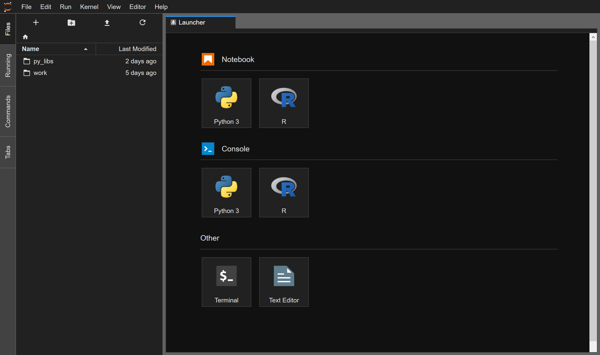
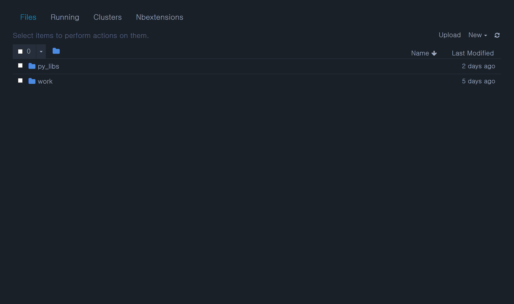
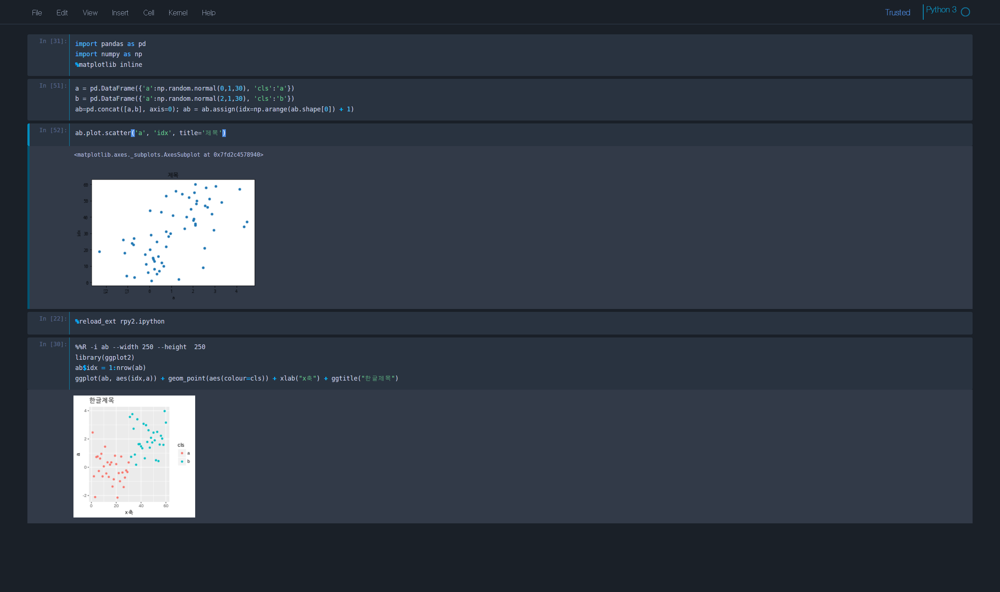

# Data Science Machine Learning Docker 

딥러닝, 통계분석, 기계학습 모델링을 위한 도커 이미지

## 주안점 

- R, Python 커널제공 
- MXNet 기본 설치(Nvidia 이미지(cuda:9.1-cudnn7, ubuntu 16.04) 기반)
- jupyter lab과 jupyter 중 선택사용
- jupyter 노트북 블랙테마 기본 적용(bitstream vera sans mono 폰트) 
- jupyter extention 및 테마 기본설치
- 주피터(Python커널) 셀 내에서 R 코드 실행 설정(with rpy2) 
- Matplotlib 한글 폰트 기본 제공(나눔코딩폰트)
- seaborn, pandas, numpy 등 핵심 패키지 기본 설치
- R 플로팅 한글 폰트 기본 제공(나눔코딩폰트)
- ggplot2, data.table 등 주요 패키지 기본 설치 
- GUID, UID 설정을 통한 마운트 디스크 권한 이슈 해결
- KoNLPy 등 한글 분석 환경 기본 설치

### 사용법

- [nvidia docker](https://github.com/NVIDIA/nvidia-docker) 설치

- 이미지 빌드 

> docker build -t img:0.01 ./ 

- 권한확인 

> id gogamza

> uid=1000(gogamza) gid=1000(gogamza) 그룹들=1000(gogamza),4(adm),24(cdrom),27(sudo),30(dip),46(plugdev),121(lpadmin),132(sambashare),998(docker)
- 실행

> docker run --runtime=nvidia -e NB_GID=1000  -e NB_UID=1000 -e GRANT_SUDO=yes --name gogamza --user root -v /home/gogamza/work:/home/gogamza/work -d -p 8888:8888 img:0.01 start.sh jupyter lab --NotebookApp.token='a1234'

### 스크린샷 

- jupyter lab 

- jupyter 

- rpy2

